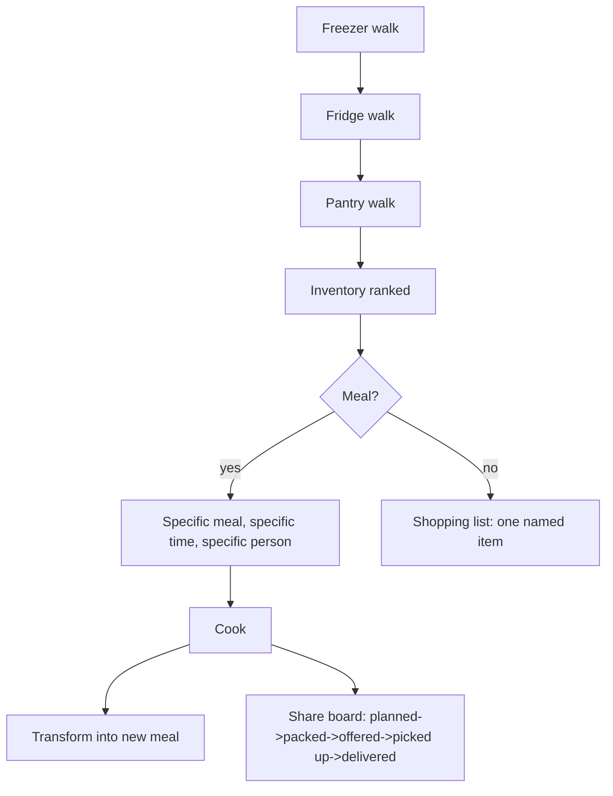
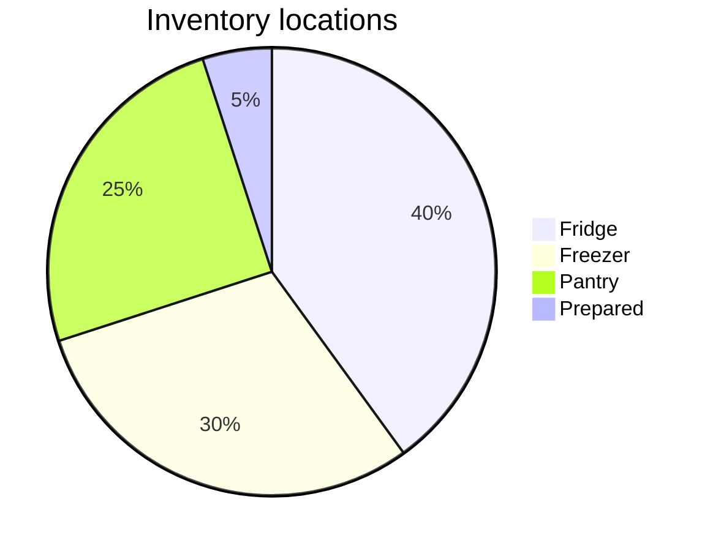

# Scratch Kitchen — Visuals

```mermaid
flowchart TD
  A[Freezer walk] --> B[Fridge walk]
  B --> C[Pantry walk]
  C --> D[Inventory ranked]
  D --> E{Meal?}
  E -- yes --> F[Specific meal, specific time, specific person]
  F --> G[Cook]
  G --> H[Transform into new meal]
  G --> I[Share board: planned->packed->offered->picked up->delivered]
  E -- no --> J[Shopping list: one named item]
```

```mermaid
pie title Inventory locations
  "Fridge" : 40
  "Freezer" : 30
  "Pantry" : 25
  "Prepared" : 5
```
